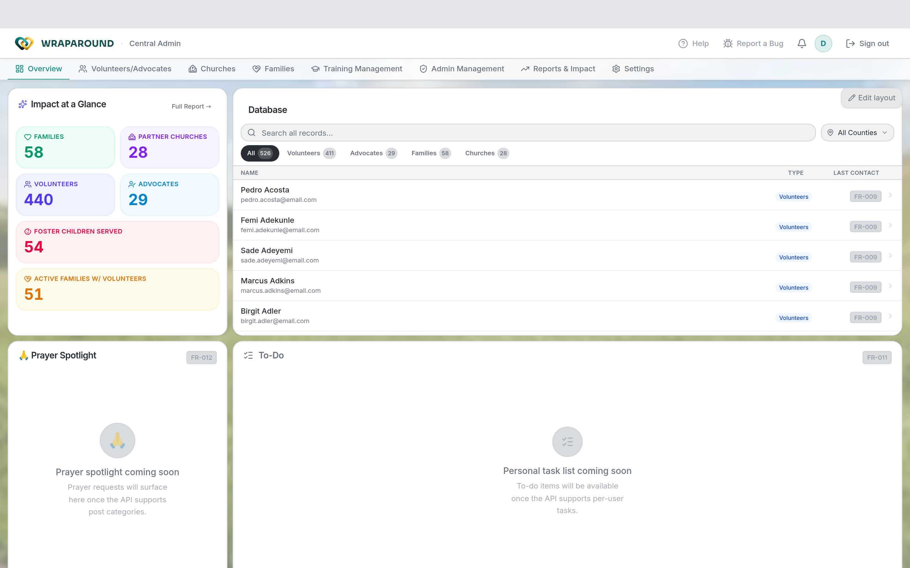

# Get started as Program Staff

Welcome! As **program staff** (an Admin) you run AlignOne for your organization. You have
**full access** — every family and all data — and you set up the people and families that
everyone else works with.

## What program staff do

You bring families into AlignOne, invite the volunteers and advocates who support them,
keep roles and statuses current, and watch over needs, schedules, and training across the
whole program.

→ [Roles & who sees what](../concepts/roles-and-visibility.md) ·
[Roles & permissions matrix](../reference/permissions-matrix.md)

!!! note "Coordinators"
    A **Coordinator** has the same full access as an Admin, focused on managing their
    county. The workflows below apply to coordinators too.

## Your first day, step by step

1. **Sign in.** Use your invite, set a password, and sign in.
   → [Accept your invite & sign in](../how-to/account/accept-invite.md)
2. **Add your families.** Create the family records — parents, children, and the primary
   contact — that everything else is organized around, one at a time with **New Family**.
   → [Manage families & people](../how-to/admin/families-and-people.md)
3. **Set up your organizations.** Make sure the churches and counties you work with are in
   place.
   → [Manage churches & counties](../how-to/admin/organizations.md)
4. **Invite your people.** Invite volunteers and advocates, assign them, and set their
   roles and statuses.
   → [Manage volunteers & advocates](../how-to/admin/volunteers-and-advocates.md) ·
   [Onboard a family & invite people](../how-to/admin/onboarding.md)
5. **Keep an eye on everything.** Track open needs, the training matrix, and the audit log.
   → [Oversight](../how-to/admin/oversight.md)

## Good to know

- Every import and key action is recorded in the **audit log**, so there's always a record
  of who changed what.
- Volunteers see **only their assigned family** — assign carefully, since that assignment
  is what scopes their access.

## Related

- [Manage families & people](../how-to/admin/families-and-people.md)
- [Statuses explained](../reference/statuses.md)
