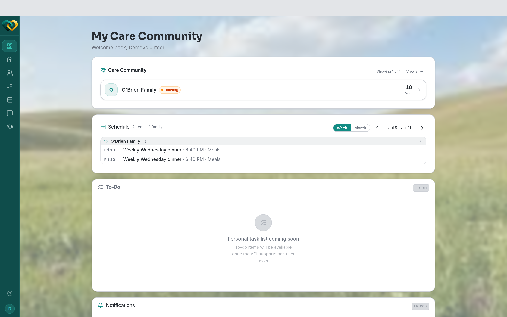

# Get started as a Volunteer

Welcome! As a **volunteer** you support **one family** — your part of their WrapAround
care circle. This page walks you through your first day on AlignOne, start to finish.

## What a volunteer does

You sign up to help your family with real, practical tasks — a meal, a ride, supplies, a
prayer — and you stay in touch with the rest of the circle. You only ever see **your own
family**; that's by design, to keep every family's information private.

→ [Roles & who sees what](../concepts/roles-and-visibility.md)

## Your first day, step by step

1. **Accept your invite and sign in.** You'll get an email invite from the program.
   Open it, set your password, and sign in.
   → [Accept your invite & sign in](../how-to/account/accept-invite.md)
2. **Finish your profile.** Add your name, contact details, and how you'd like to help.
   → [Update your profile](../how-to/account/update-profile.md)
   and [upload your photo](../how-to/account/upload-photo.md).
3. **Complete any training.** If the program assigned training modules, work through them.
   → [Find your modules & track progress](../how-to/training/modules-and-progress.md)
4. **Meet your family.** Open your family to see who you're supporting.
   → [View your family](../how-to/family/view-your-family.md)
5. **Claim your first need.** Browse what the family needs help with and sign up for one.
   → [Browse open needs](../how-to/needs/browse-needs.md) ·
   [Claim a need](../how-to/needs/claim-a-need.md)
6. **Check the schedule.** See what's coming up and the commitments you've taken on.
   → [View the calendar](../how-to/schedules/view-calendar.md)
7. **Say hello.** Introduce yourself to the circle in messages.
   → [Start a thread](../how-to/messaging/start-thread.md)

## What to do next

- Turn on [notifications](../how-to/messaging/notifications.md) so you don't miss a request.
- Read recent [posts](../how-to/posts/read-and-comment.md) to catch up on the family's news.

!!! tip "Stuck?"
    If you can't sign in or didn't get your invite, see
    [Troubleshooting](../reference/troubleshooting.md).
