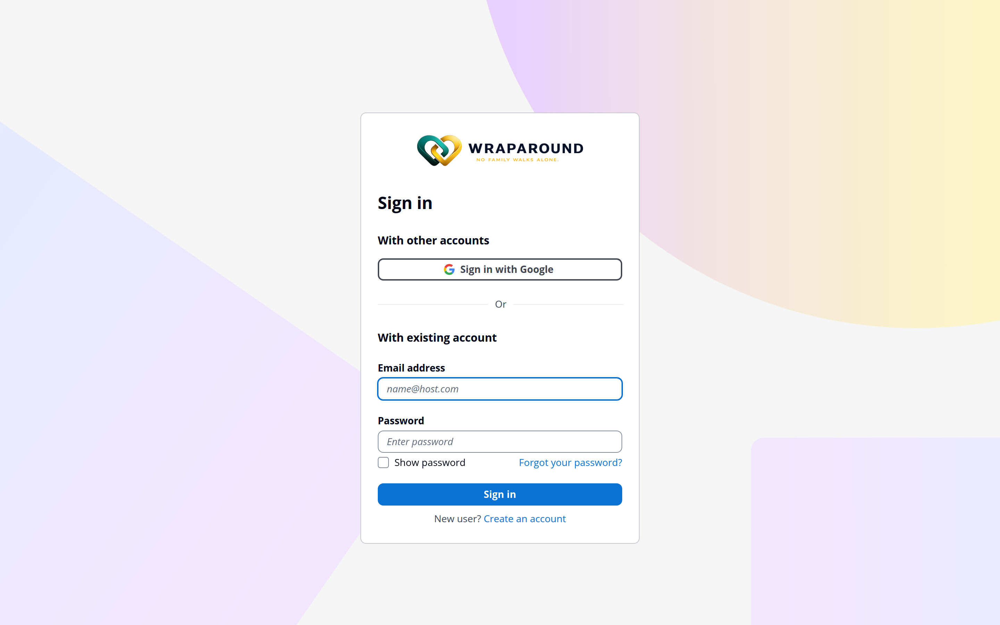

# Accept your invite & sign in

**Who this is for:** Anyone joining AlignOne — volunteers, advocates, and program staff.
**When to use it:** The first time you join, after the program emails you an invite.
**Before you start:** An invite email sent to your address. Invite links expire (typically
after 7 days), so use yours promptly.

## Steps

1. Open the **invite email** from AlignOne and select the **invite link**.
   <!-- @frontend: confirm sender name + the exact wording of the button/link in the email -->
2. The link opens AlignOne and asks you to **set a password**. Choose a password and
   confirm it.  <!-- @frontend: confirm the registration screen heading + password rules -->
3. Submit to create your account. AlignOne signs you in and finishes setting you up.
4. After this, sign in any time: from the home page choose **Sign in**, then enter your
   **email address** and **password** on the WrapAround sign-in screen and choose **Sign in**.

## What you'll see

Once you're signed in, you land on your **dashboard** — your home base in AlignOne. From
here you can reach your family, needs, schedule, and messages.

!!! tip "Use your invited email"
    Sign in with the **same email address** the invite was sent to. That address is how
    AlignOne connects you to the right family and role.

## Related

- [Update your profile](update-profile.md)
- [Upload your photo](upload-photo.md)
- [Didn't get your invite, or can't sign in?](../../reference/troubleshooting.md)
