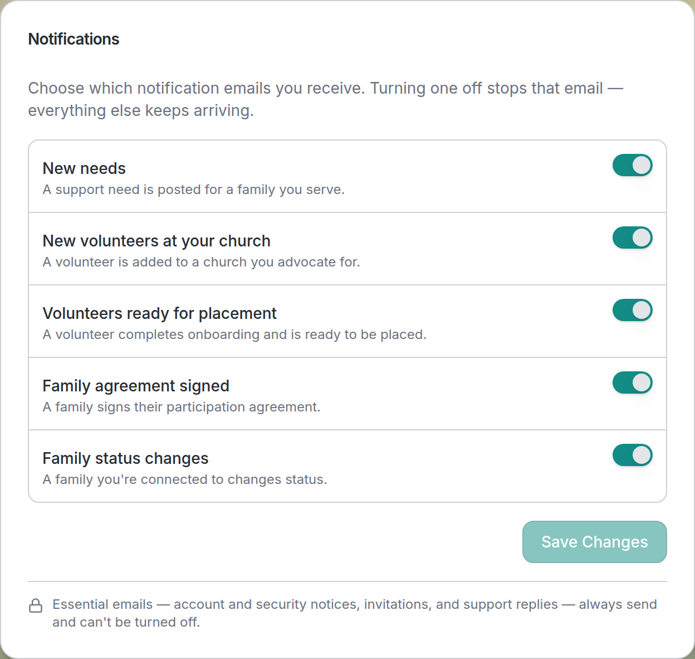
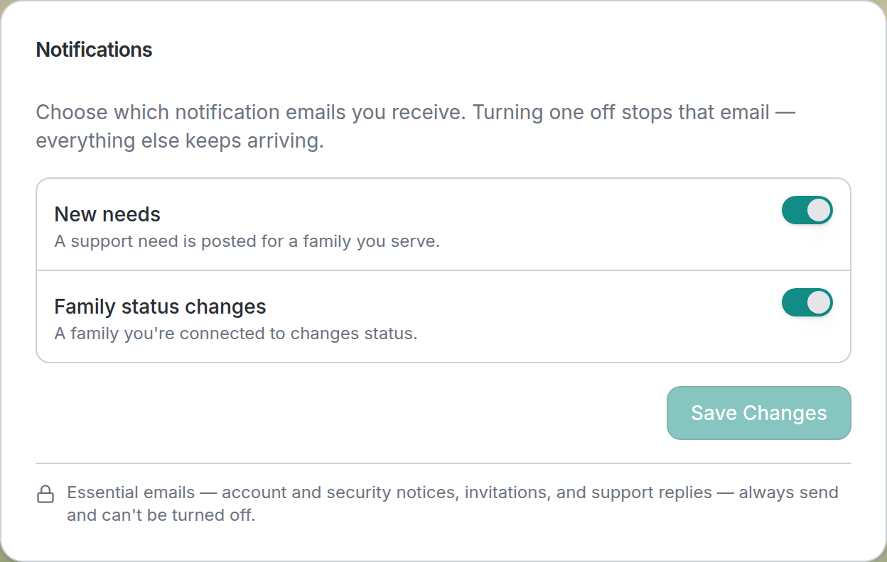
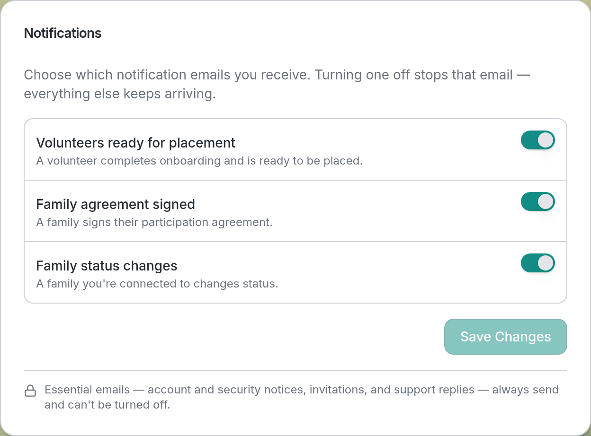
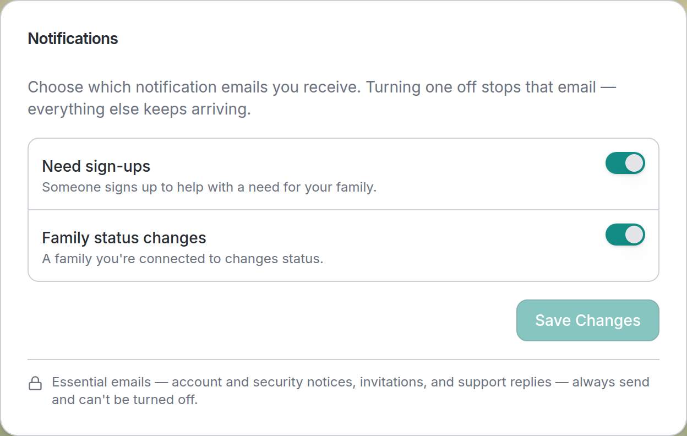

# Manage your notification emails

**Who this is for:** Everyone with an AlignOne account — volunteers, lead volunteers, advocates, program staff, and families.
**When to use it:** Any time you're getting too many (or too few) emails, or when your role changes what you're notified about.
**Before you start:** You've [accepted your invite and signed in](accept-invite.md).

AlignOne sends you an email when something happens that you might want to act on — a
new need is posted, a volunteer finishes onboarding, a family's status changes. You
control which of these emails you receive from your account settings. Turning one off
stops **only** that email; everything else keeps arriving.

## Open your Profile Settings

Everyone manages notifications from the same **Profile Settings** screen, but how you get
there depends on your role.

### Volunteers, advocates, and families

- **On a computer:** move your pointer over the **left sidebar** to expand it, then select
  **your name and profile picture** at the bottom of the sidebar.
- **On a phone:** tap your **profile picture** in the top-right corner.

### Coordinators and administrators

- In the **top navigation bar**, select **Settings** (the gear icon).
- Or, from any screen, select your **profile picture** in the top-right corner.

Either way, you land on **Profile Settings**. Scroll down to the **Notifications** card.

## Turn notification emails on or off

1. In the **Notifications** card, use the **toggle** next to each notification type to turn
   its email **on** (green) or **off** (grey).
2. Select **Save Changes** to apply them. The button stays greyed out until you've actually
   changed something, so if it's inactive you have nothing left to save.

## What you'll see

A short confirmation appears once your changes are saved, and they stick — reload the page
or sign in again later and your choices are still there. Any email you switched off simply
stops arriving; the matching in-app notifications are unaffected.

!!! info "Only the types that apply to you are shown"
    The Notifications card lists just the notifications your role can actually receive, so
    the list below will differ from a teammate's in a different role. That's expected.

## What each role can turn on or off

The exact toggles you see depend on your role. Here's what each role controls.

### Volunteers

Two notifications, focused on the families you help:

- **New needs** — A support need is posted for a family you serve.
- **Family status changes** — A family you're connected to changes status.

### Lead volunteers

Everything a volunteer sees, plus a heads-up when help is claimed:

- **New needs** — A support need is posted for a family you serve.
- **Need sign-ups** — Someone signs up to help with a need.
- **Family status changes** — A family you're connected to changes status.

### Advocates

The widest set, covering both your families and the volunteers at your church:

- **New needs** — A support need is posted for a family you serve.
- **New volunteers at your church** — A volunteer is added to a church you advocate for.
- **Volunteers ready for placement** — A volunteer completes onboarding and is ready to be placed.
- **Family agreement signed** — A family signs their participation agreement.
- **Family status changes** — A family you're connected to changes status.

### Program staff (coordinators & admins)

County coordinators and administrators share the same three notifications, focused on
onboarding and family milestones:

- **Volunteers ready for placement** — A volunteer completes onboarding and is ready to be placed.
- **Family agreement signed** — A family signs their participation agreement.
- **Family status changes** — A family you're connected to changes status.

### Families

Two notifications about the help coming to your family:

- **Need sign-ups** — Someone signs up to help with a need for your family.
- **Family status changes** — A family you're connected to changes status.

## Emails you can't turn off

Some emails are essential and always send, so they don't appear as toggles. A locked note
at the bottom of the card spells this out:

> Essential emails — account and security notices, invitations, and support replies —
> always send and can't be turned off.

This keeps you from missing a sign-in alert, an invitation, or a reply from support.

!!! tip "Getting too much email? Start with the noisiest toggle"
    If your inbox feels busy, turn off the one notification you act on least and keep the
    rest. You can come back and re-enable it any time.

## Related

- [Update your profile](update-profile.md)
- [Upload your photo](upload-photo.md)
- [Messaging notifications](../messaging/notifications.md)
