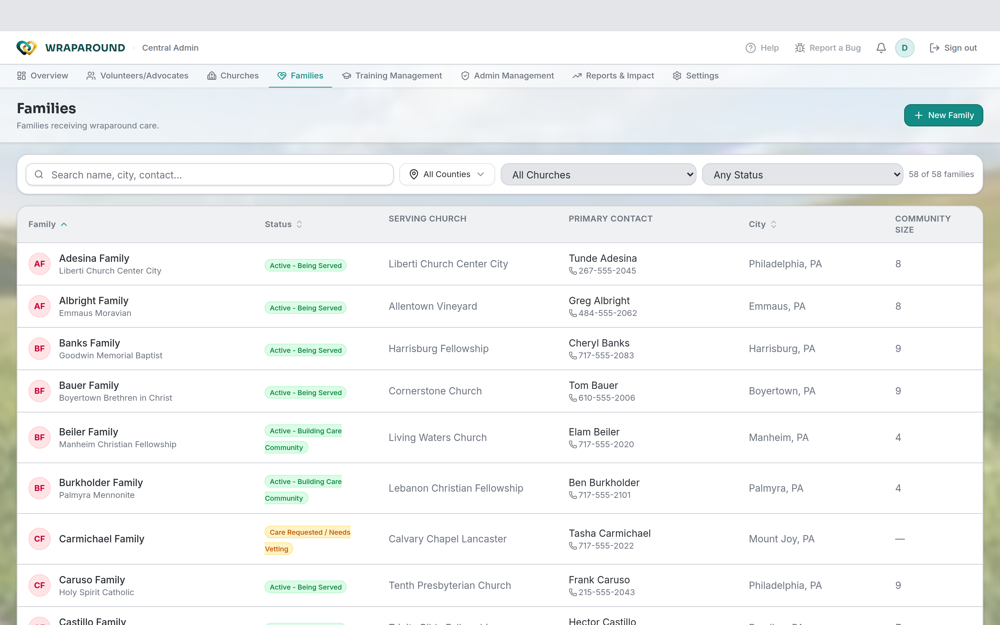
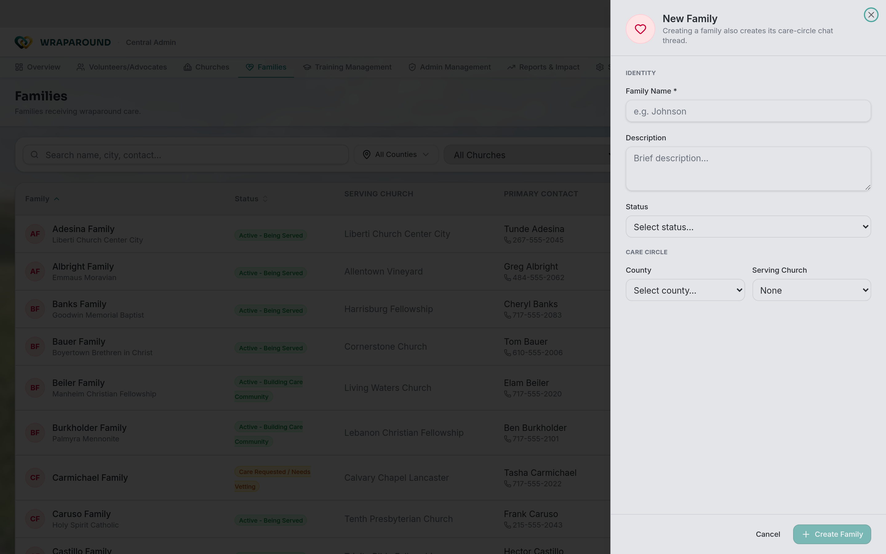

<!-- @backend verified: a "community" IS a family (1:1 merge); the family is the WrapAround
     care circle. Family records hold parents and children; one parent is the primary contact.
     CSV import of families is supported and every import is written to the audit log. -->

# Manage families & people

**Who this is for:** Program staff (Admins and Coordinators); advocates for their church's
families.
**When to use it:** When you set up a new family or update who's in one.
**Before you start:** You're signed in with staff access.

## The family is the care circle

In AlignOne a **family** *is* the WrapAround care circle — everything else is organized
around it. A family record holds its **parents** and **children**, with one parent set as
the **primary contact**.

## Add a family

1. Open **Families** and choose **New Family**.
2. Fill in the **Family Name**, an optional **Description**, a **Status**, and the family's
   **County** and **Serving Church**. Choose **Create Family** — this also starts the
   family's care-circle chat thread.
3. Open the new family and add its **parents** and **children**, setting one parent as the
   **primary contact** — the main point of contact for the circle. The family is then ready
   for volunteers and a schedule.

## Update a family

1. Open the family from **Families**.
2. Edit the family's details, add or remove **parents/children**, change the
   **primary contact**, or [upload a family photo](#upload-a-family-photo).
3. **Save** your changes.

## Upload a family photo

1. Open the family and select its **photo**.
2. Choose an image and confirm to upload.

## Export families to CSV

From the **Overview**, open the **Database** panel (the master list) and switch to the
**Families** tab. **Export CSV** downloads the list — useful for reporting or backups.

!!! note "Bulk import is a staff/migration step"
    Adding many families at once from a CSV is handled by program staff during setup or
    migration rather than as a self-serve button in the app. Every such import is recorded in
    the **audit log**. Day to day, add families one at a time with **New Family** above.

!!! warning "Never use real PII in examples or templates you share"
    Family information is sensitive. Keep any exported or filled-in CSV files secure and out
    of shared locations.

## Related

- [Manage volunteers & advocates](volunteers-and-advocates.md)
- [Onboard a family & invite people](onboarding.md)
- [Manage churches & counties](organizations.md)
- [Oversight](oversight.md)
