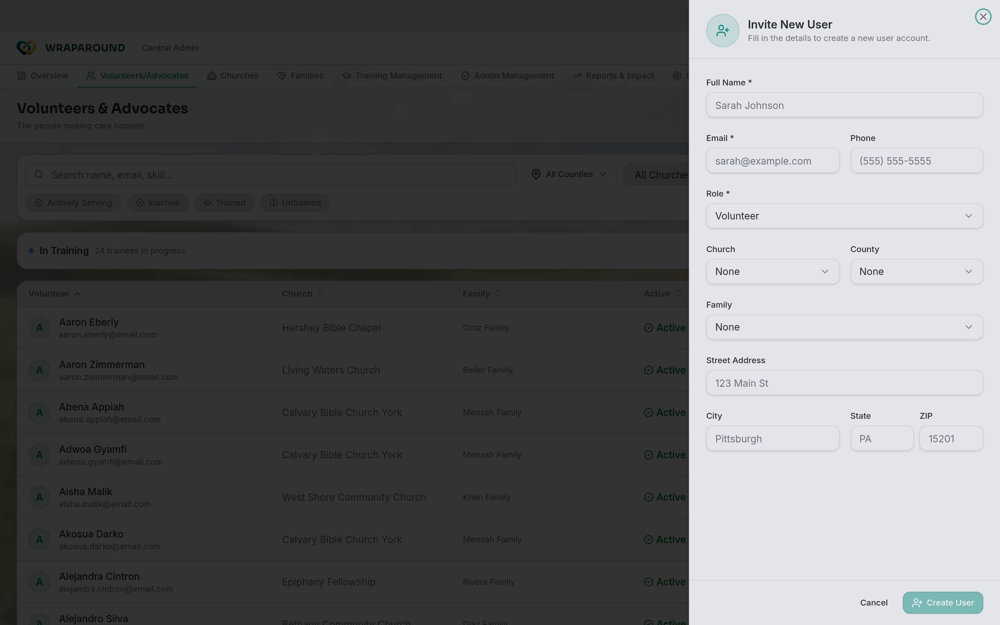

<!-- @backend verified: onboarding is email-invite based; invite links are secure and
     expire (typically 7 days). A newly self-registered family starts at "Care Requested /
     Needs Vetting" and must be approved by staff before becoming active. -->

# Onboard a family & invite people

**Who this is for:** Program staff (Admins and Coordinators); advocates for their church.
**When to use it:** When you bring a new family into AlignOne and invite the people who'll
support them.
**Before you start:** You're signed in with staff access.

## Onboard a family

1. [Create the family record](families-and-people.md) — Complete family profile and information gathering.
2. Make sure that the new family is configured it to the right **county** and **serving church**. **Serving Church** is important since this gives the serving church's advocate's access to see the family. → [Manage churches & counties](organizations.md)
   - It is also possible to manually assign individual advocates to a family. This is for the edge case where a serving church doesn't have any fully trained advocates. In this case when the serving church does eventually have advocates, the newly trained advocates will automatically be able to see the family.
4. At this point it is also possible to assign volunteers
5. You will not be able to **Activate** or change a families status from **Care Requested / Needs Vetting** status, until one parent or care giver signs into the wraparound application and signs the family agreement. <!-- Need a page about signing a family agreement -->

### Approving a self-registered family

A family that **registers itself** doesn't go live automatically. It starts at
**Care Requested / Needs Vetting** and waits for staff to review it.

1. Open **Families**. A family awaiting review carries the **Care Requested / Needs Vetting**
   status — use the **Status** filter to list them.
2. Review the details, then **approve** the family (change its status) to move it into active
   service.
   → [Statuses explained](../../reference/statuses.md)

## Invite a person

1. From **Volunteers/Advocates**, choose **Create New User** and fill in the person's name,
   email, and role. → [Manage volunteers & advocates](volunteers-and-advocates.md)
2. They get an email to [accept and set a password](../account/accept-invite.md).

## Resend an invite <!-- Needs review -->

If someone didn't get their invite or it expired:

1. Open the person's record from **Volunteers/Advocates**.
2. Choose **Resend Invite**.
3. A new invite email goes out with a fresh link.

!!! tip "Invites expire"
    Invite links are time-limited (typically 7 days). If someone waited too long, resend
    rather than troubleshooting the old link.

## Related

- [Manage families & people](families-and-people.md)
- [Manage volunteers & advocates](volunteers-and-advocates.md)
- [Troubleshooting](../../reference/troubleshooting.md)
