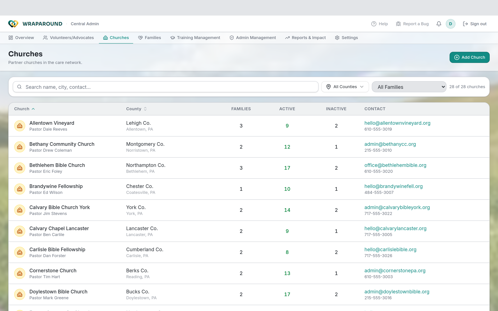

<!-- @backend verified: families are associated with a county; advocates are scoped to a
     serving church (distinct from a family's attending church). Churches and communities/
     families can be CSV-imported, with imports recorded in the audit log. -->

# Manage churches & counties

**Who this is for:** Program staff (Admins and Coordinators).
**When to use it:** When you set up or update the churches and counties your program works
with.
**Before you start:** You're signed in with staff access.

## Why churches and counties matter

- **Churches** are how advocates are scoped: an advocate can see every family whose
  **serving church** is theirs. (A family's *serving* church — the one coordinating care —
  can differ from the church a family *attends*.)
- **Counties** group families and volunteers geographically; coordinators manage by county.

## Manage churches

1. Open **Churches**.
2. Choose **Add Church**, or open an existing one to edit its details.
3. Save. Advocates assigned to that church will see the families it serves.

The directory shows each church's **county**, its **families**, and how many volunteers are
**active** vs. **inactive**, with search and **All Counties** / **All Families** filters.

## Counties

Counties group families and volunteers geographically, and coordinators manage by county.
There isn't a separate county-management screen — the county list is maintained centrally.
Counties show up as a **filter** on the Churches, Families, and Volunteers directories and as
a **County** field when you create a family, church, or user.

## Export churches to CSV

From the **Overview**, open the **Database** panel (the master list) and switch to the
**Churches** tab, then **Export CSV**. Bulk *import* of churches is handled by staff during
setup/migration and is recorded in the **audit log**.

## Related

- [Manage families & people](families-and-people.md)
- [Manage volunteers & advocates](volunteers-and-advocates.md)
- [Roles & who sees what](../../concepts/roles-and-visibility.md)
