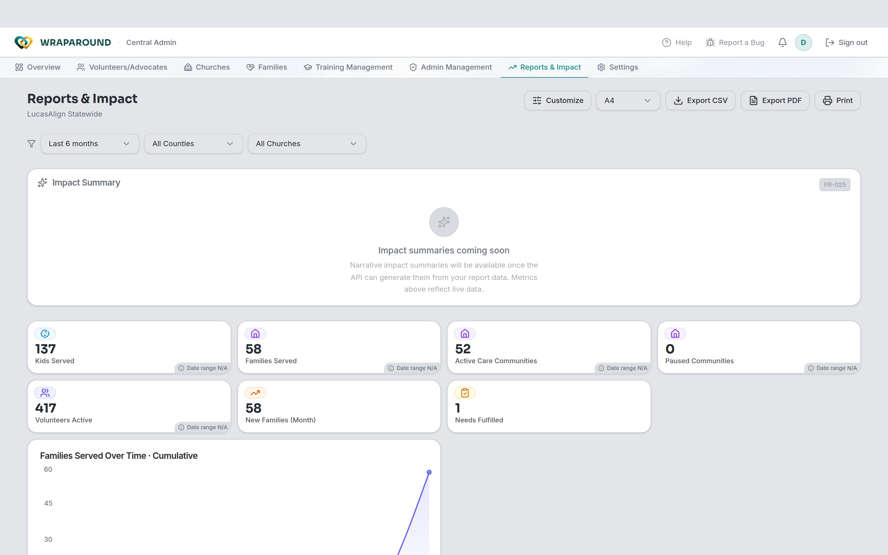
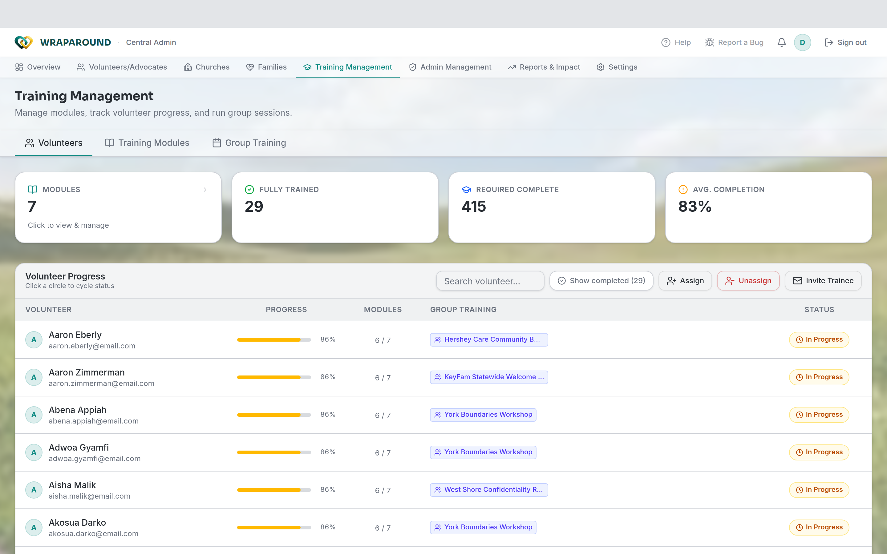
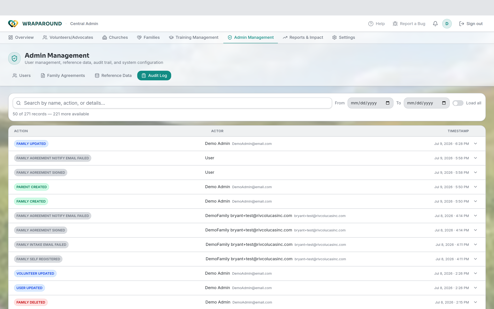

<!-- @backend verified: every import/key operation is written to the audit log; the audit
     log is visible to Admins and Coordinators, not to advocates or volunteers. Training
     completion auto-promotes a trainee to "trained, not active" pending activation. -->

# Oversight

**Who this is for:** Program staff (Admins and Coordinators).
**When to use it:** To keep an eye across the whole program — what's covered, who's trained,
and what's changed.
**Before you start:** You're signed in with staff access.

## Needs coverage

Admins and Coordinators don't have a needs board of their own — needs live with each family
and are worked by advocates and volunteers. To watch coverage across the program, use
**Reports & Impact**, which surfaces figures like **Needs Fulfilled** alongside families and
volunteers served.

## Training matrix

See who has completed which training modules at a glance.

1. Open **Training Management** and stay on the **Volunteers** tab to see the
   **Volunteer Progress** matrix.
2. Find people who are **trained but not yet active** and
   [activate them](volunteers-and-advocates.md#activate-a-trained-volunteer).

## County analytics

Coordinators and admins can review **county-level** numbers to understand reach and load by
county. Open **Reports & Impact** and use the **County** filter to focus on one county; you
can **Export CSV** or **Export PDF** for sharing.

## Audit log

Every import and key change is recorded in the **audit log**, so there's always a record of
who did what.

1. Open **Admin Management** and choose the **Audit Log** tab.
2. Search by name, action, or details (or filter by date) to confirm an import landed or to
   trace a change. The audit log is available to Admins and Coordinators only.

## Related

- [Manage volunteers & advocates](volunteers-and-advocates.md)
- [Manage families & people](families-and-people.md)
- [Roles & permissions matrix](../../reference/permissions-matrix.md)
