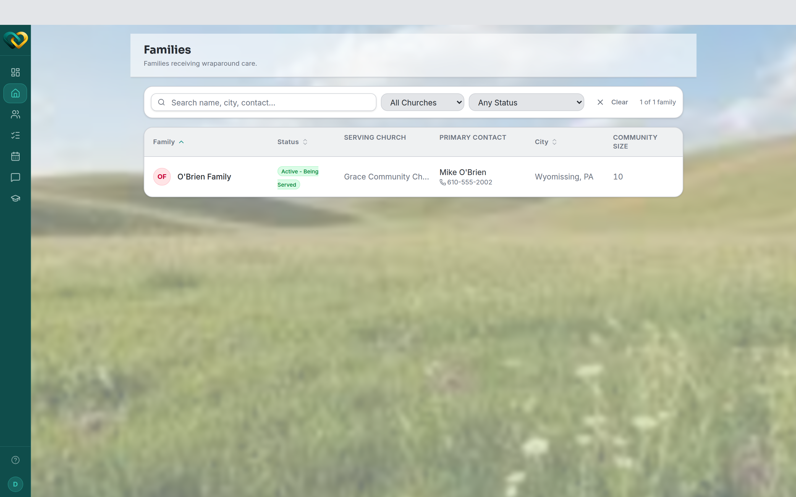

# View your family

**Who this is for:** Lead Volunteers and Advocates (who have a **Families** directory).
Support Volunteers don't have a separate family page — see the note below.
**When to use it:** To see who you're supporting and how to reach them.
**Before you start:** You've [accepted your invite and signed in](../account/accept-invite.md),
and you're assigned to a family.

!!! note "Support Volunteers: no separate family page"
    If you're a **Support Volunteer**, there's no standalone family screen — you see your one
    family's context directly through its [needs](../needs/browse-needs.md),
    [schedule](../schedules/view-calendar.md), and [messages](../messaging/start-thread.md).
    The steps below apply to **Lead Volunteers** and **Advocates**, who get a Families list.

## Steps

1. From the main menu, open **Families**.
2. The directory lists each family with its **Status**, **Serving Church**, **Primary
   Contact**, **City**, and **Community Size**. Search or filter to find the one you want.
3. Open a family to see its full profile, then jump to its
   [needs](../needs/browse-needs.md), [schedule](../schedules/view-calendar.md), and
   [messages](../messaging/start-thread.md).

## What you'll see

A profile for each family in your scope — a **Lead Volunteer** sees their one family; an
**Advocate** sees every family their church serves. You never see families outside your
scope; that's how AlignOne keeps every family's information private.

→ [Roles & who sees what](../../concepts/roles-and-visibility.md)

!!! note "Information is private"
    Treat everything you see about your family as confidential. Don't share family details
    outside the care circle.

## Related

- [Browse open needs](../needs/browse-needs.md)
- [What is WrapAround?](../../concepts/what-is-wraparound.md)
