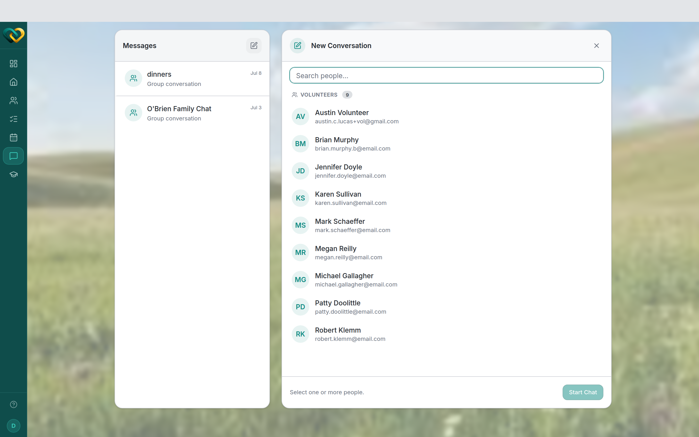

# Start a thread

**Who this is for:** Volunteers, advocates, and program staff.
**When to use it:** When you want to talk with your care circle — ask a question,
coordinate a hand-off, or introduce yourself.
**Before you start:** You've [accepted your invite and signed in](../account/accept-invite.md),
and you're part of a family's circle.

## What a thread is

A **thread** is a conversation within your care circle. Pick **one** person for a direct
message, or **several** people for a group thread (which you can give a name).

## Steps

1. From the main menu, open **Messages**.
2. Tap the **compose** icon (labelled **New conversation**) at the top of the thread list.
3. Pick who it's for — select **one** person for a direct message, or **several** for a
   group. For a group you can add a thread name (**"Family Chat"** is reserved and can't be
   used). Choose **Start Chat**.
4. Type your message and **send**.

## What you'll see

Your new thread appears in the messages list, and everyone you included can read and reply.

!!! tip "Keep it in the circle"
    Messages are private to the people in the conversation. Share family details only with
    your circle, never outside it.

## Related

- [Replies & read receipts](reply-read-receipts.md)
- [Notifications](notifications.md)
