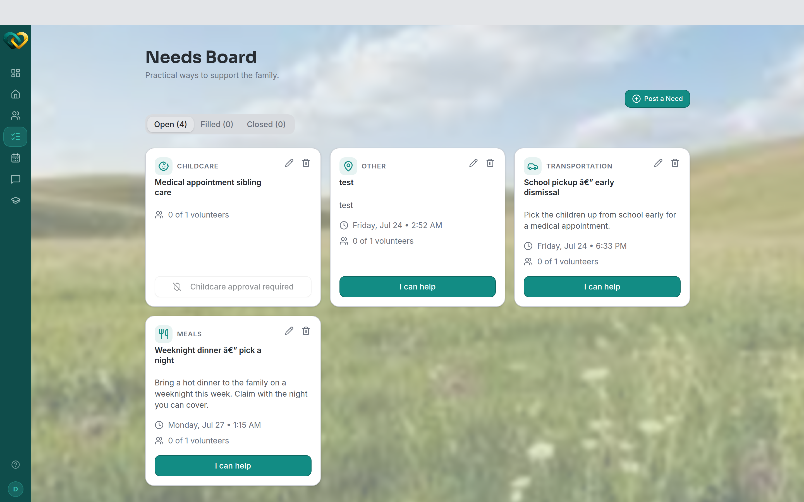

# Browse open needs

**Who this is for:** Volunteers (advocates and program staff can do this too).
**When to use it:** When you want to see what your family needs help with and find
something to sign up for.
**Before you start:** You've [accepted your invite and signed in](../account/accept-invite.md),
and you're assigned to a family.

## Steps

1. From the main menu, open **Needs**.
   You'll see your family's needs. As a volunteer, this is the **one family** you're
   assigned to — you won't see other families' needs.
2. Needs are grouped into **Open** (nobody has claimed them yet), **Filled** (enough
   volunteers have signed up), and **Closed**. Start with the **Open** group.
3. Each need shows its **type** (such as a meal, a ride, supplies, an errand, yardwork, or
   prayer), **when** it's needed, and a short description.
   <!-- @backend: confirm the canonical need types/categories shown to volunteers -->
4. Tap any need to open it and read the full details before deciding.

## What you'll see

A list of your family's needs, with the open ones clearly marked. From here you can pick
one and [claim it](claim-a-need.md).

!!! tip "Grouped by status"
    Needs are grouped by status — **Open**, **Filled**, and **Closed** — so the ones you
    can still pick up are together at the top. (There's no filter by type or date yet.)

## Related

- [Claim a need](claim-a-need.md)
- [What is WrapAround?](../../concepts/what-is-wraparound.md)
- [Statuses explained](../../reference/statuses.md)
