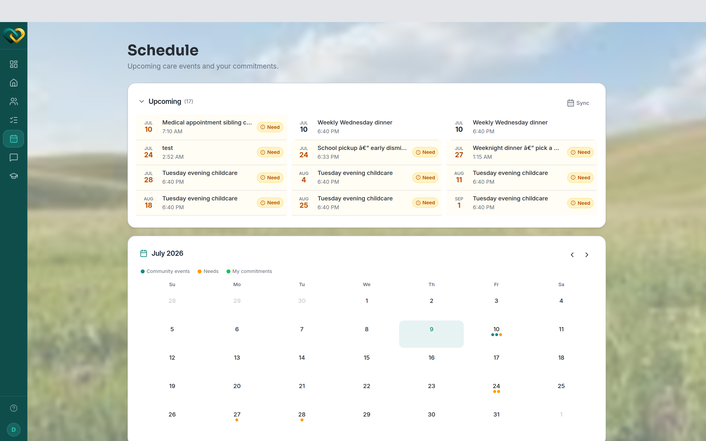

# Understand recurring events

**Who this is for:** Volunteers, advocates, and program staff.
**When to use it:** When a calendar entry repeats and you want to know what you're
signing up for.
**Before you start:** You can [view the calendar](view-calendar.md) for your family.

## What a recurring event is

A **recurring event** repeats on a rule — for example *"every Tuesday at 2pm"* — instead
of being a single one-off. On the calendar it shows up on each day the rule lands, so a
weekly ride appears every week without anyone re-entering it.

## What to check before you sign up

1. A repeating need shows a **recurrence badge** (the rule's name, such as *Weekly*) on its
   card, so you can tell it's part of a series.
2. You claim **one occurrence at a time** — each date is its own need, so signing up for
   this week's ride doesn't commit you to every week.
3. If you can only do some dates, claim just those and leave the rest open.

## What you'll see

Recurring events appear on every date they apply to. When you sign up, your name shows on
the occurrence(s) you committed to.

!!! tip "Repeating help is a big help"
    Families rely on steady, predictable support. If you can take a recurring slot, it
    gives them something dependable to plan around.

## Related

- [View the calendar](view-calendar.md)
- [Sign up for a slot](sign-up-slot.md)
