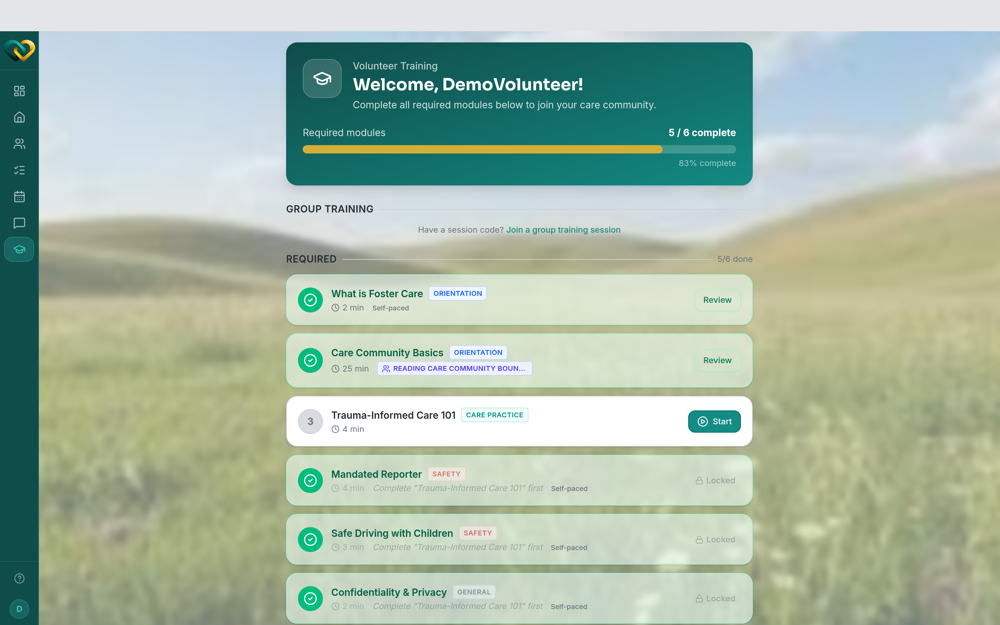

<!-- @backend verified: completing all assigned modules auto-promotes a trainee to
     "trained, not active"; an admin then activates them before they serve. -->

# Find your modules & track progress

**Who this is for:** Volunteers and advocates completing training.
**When to use it:** When the program has assigned you training to finish before (or while)
you serve.
**Before you start:** You've [accepted your invite and signed in](../account/accept-invite.md).

## Steps

1. From the main menu, open **Training**.
   You'll see your **modules** and your progress on each.
2. Open a module to work through it, then tap **Mark Complete** when you're done.
3. Repeat until every assigned module shows as complete. Your progress updates as you go.

## What happens when you finish

When you complete **all** your assigned modules, AlignOne records you as **trained**. A
program staff member then **activates** you so you can start serving a family — there can
be a short wait for that step.

## What you'll see

A list of your modules with a clear done / not-done state, and an overall sense of how much
is left.

!!! tip "Finish before you're needed"
    Completing training early means you're ready to be activated and placed with a family
    as soon as there's a fit.

## Related

- [Access training resources](resources.md)
- [Statuses explained](../../reference/statuses.md)
